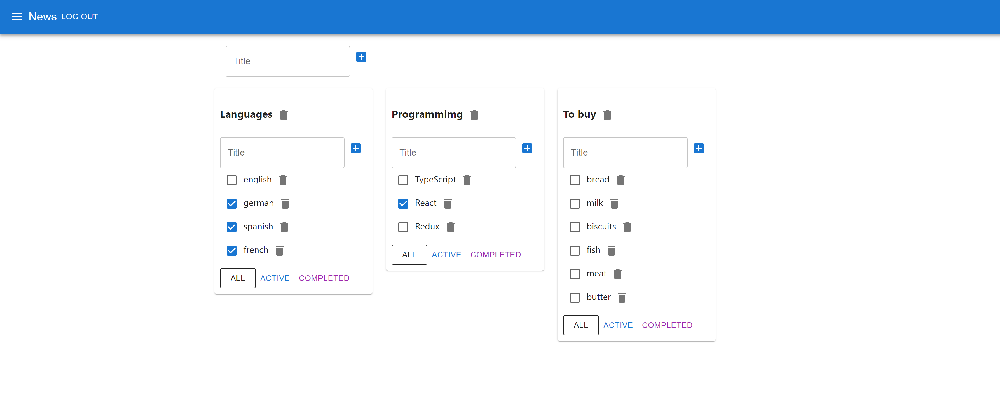

## Projects Title:

Task board

## About The Project:

This application is a learning cards application which allows users to create their own boards with tasks for personal use.

## Built With:

- React
- Redux-Toolkit
- Redux-Thunk
- React-route-dom v6
- TypeScript
- Formik
- Axios
- Material UI
- Jest

## Usage:

To use the project you need to Sign Up firstly. After that just Sing In and go to main page. There you will have a possibility to create your own boards with tasks.

## Contact:

DoWhatYouL0ve

- LinkedIn: https://www.linkedin.com/in/williamr0ss/
- GitHub: https://github.com/DoWhatYouL0ve
- Email: william_ross@mailfence.com

## License:

MIT License

Copyright (c) [year] [fullname]

Permission is hereby granted, free of charge, to any person obtaining a copy
of this software and associated documentation files (the "Software"), to deal
in the Software without restriction, including without limitation the rights
to use, copy, modify, merge, publish, distribute, sublicense, and/or sell
copies of the Software, and to permit persons to whom the Software is
furnished to do so, subject to the following conditions:

The above copyright notice and this permission notice shall be included in all
copies or substantial portions of the Software.

THE SOFTWARE IS PROVIDED "AS IS", WITHOUT WARRANTY OF ANY KIND, EXPRESS OR
IMPLIED, INCLUDING BUT NOT LIMITED TO THE WARRANTIES OF MERCHANTABILITY,
FITNESS FOR A PARTICULAR PURPOSE AND NONINFRINGEMENT. IN NO EVENT SHALL THE
AUTHORS OR COPYRIGHT HOLDERS BE LIABLE FOR ANY CLAIM, DAMAGES OR OTHER
LIABILITY, WHETHER IN AN ACTION OF CONTRACT, TORT OR OTHERWISE, ARISING FROM,
OUT OF OR IN CONNECTION WITH THE SOFTWARE OR THE USE OR OTHER DEALINGS IN THE
SOFTWARE.

